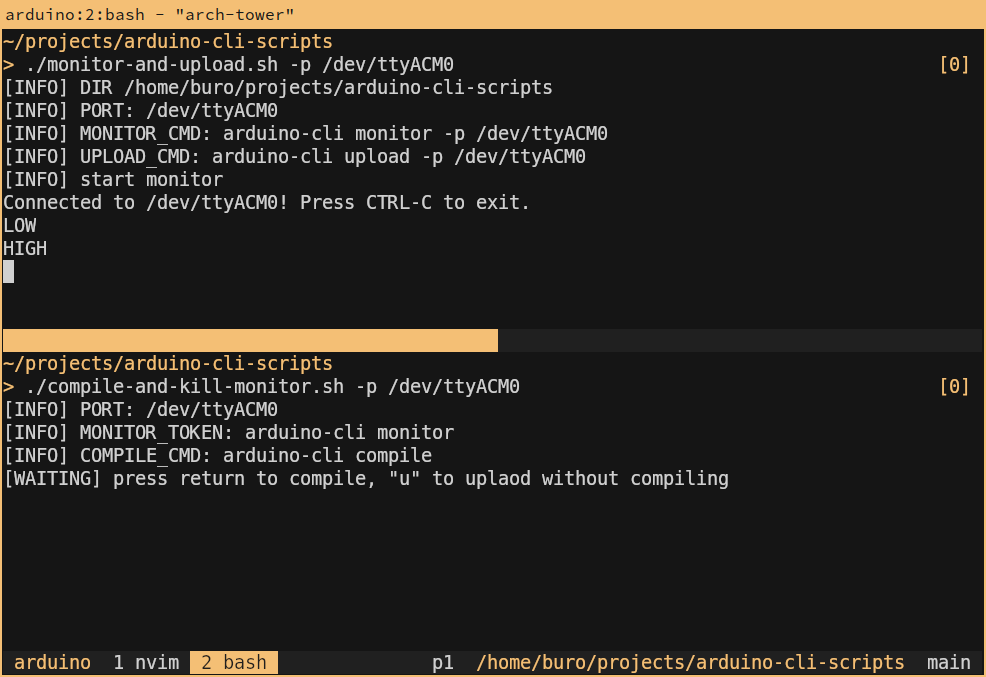

# Development scripts for arduino-cli

A couple of shell scripts/template to make development smoother.



## Get started

1. copy `monitor-and-upload.sh` and `compile-and-kill-monitor.sh` into your project directory;
2. edit, if needs, the two script files to meet your compile/monitor/upload specifications;
3. run the two scripts in two different terminals.

## Project compilation via arduino-cli

In order to compile your Arduino project you have to [create a sketch.yaml file](https://arduino.github.io/arduino-cli/0.35/sketch-project-file/).

### Get the fqbn and platform

Connect your arduino device and execute:
```sh
arduino-cli board list
```

You should find port, FQBN and Core (platform).

Available platforms:
```sh
arduino-cli core list --all
```

Installed platforms:
```sh
arduino-cli core list
```
